# Trade Service 流程图文档

## 1. 系统总体架构

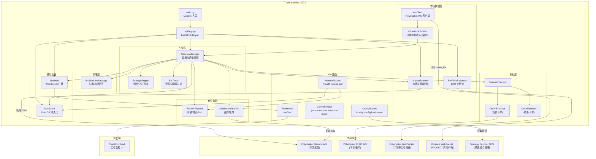

---

## 2. 启动流程 (Lifespan)

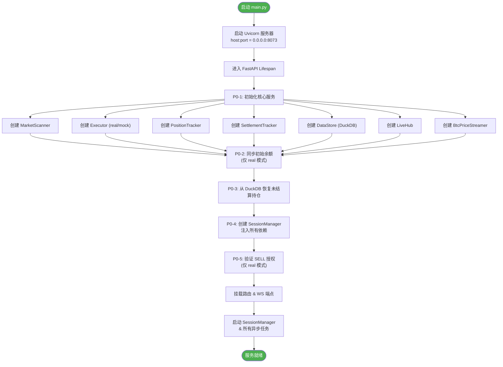

---

## 3. 会话管理主循环 (SessionManager)

```mermaid
flowchart TD
    TICK([主循环 1s Tick]) --> RECORD["A. 记录价格<br/>BTC → btc_history<br/>Token → poly_price_history"]

    RECORD --> DISCOVER["B. 发现会话<br/>current = scanner.get_current_or_next()<br/>next = scanner.get_next_after()"]

    DISCOVER --> PREPARE{"C. next 距开始<br/>< 60s ?"}
    PREPARE -->|是| WS_SUB["WS 预订阅<br/>next.token_ids"]
    PREPARE -->|否| ACTIVATE
    WS_SUB --> ACTIVATE

    ACTIVATE{"D. now >= current<br/>.start_epoch ?"}
    ACTIVATE -->|是, 且 state=PENDING| DO_ACTIVATE["激活会话<br/>创建策略实例<br/>on_session_start()<br/>state → ACTIVE"]
    ACTIVATE -->|否 或 已激活| HANDLE

    DO_ACTIVATE --> HANDLE

    HANDLE{"E. state == ACTIVE ?"}
    HANDLE -->|否| EXPIRE_CHECK
    HANDLE -->|是| TREND_CHECK

    TREND_CHECK{"已过 window_2<br/>且未计算趋势?"}
    TREND_CHECK -->|是| BTC_TREND["计算 BTC 趋势<br/>a1, a2, amplitude, direction"]
    TREND_CHECK -->|否| MARKET_UPDATE
    BTC_TREND --> BRANCH_SELECT["选择组合分支<br/>(按 amplitude 匹配)"]
    BRANCH_SELECT --> REINIT["重新初始化策略<br/>on_session_start(branch_config)<br/>on_btc_trend_result()"]
    REINIT --> MARKET_UPDATE

    MARKET_UPDATE["策略评估<br/>on_market_update(ctx)"] --> ENTRY{"有入场信号?"}
    ENTRY -->|是| EXEC_ENTRY["执行 BUY 信号"]
    ENTRY -->|否| EXIT_CHECK

    EXEC_ENTRY --> EXIT_CHECK
    EXIT_CHECK["should_close(ctx)"] --> EXIT{"有出场信号?"}
    EXIT -->|是| EXEC_EXIT["执行 SELL 信号<br/>(TP / SL / 强平)"]
    EXIT -->|否| BROADCAST

    EXEC_EXIT --> BROADCAST
    BROADCAST["广播 market snapshot<br/>至 WebSocket 客户端"] --> EXPIRE_CHECK

    EXPIRE_CHECK{"F. now >= current<br/>.end_epoch ?"}
    EXPIRE_CHECK -->|是| EXPIRE["到期处理<br/>尝试最后平仓<br/>state → SETTLING<br/>入结算队列<br/>next → current"]
    EXPIRE_CHECK -->|否| SETTLE_BG

    EXPIRE --> SETTLE_BG

    SETTLE_BG["G. 后台结算处理<br/>(轮询 Gamma 每 60s)"] --> TICK

    style TICK fill:#2196F3,color:#fff
```

---

## 4. 会话状态机

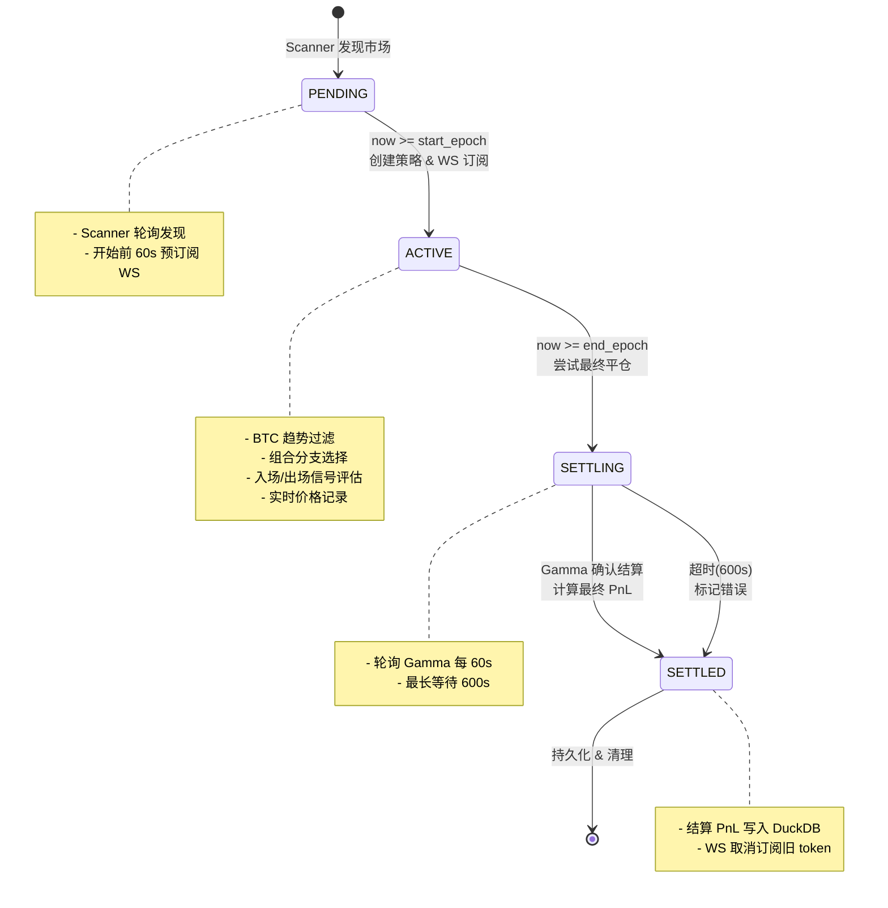

---

## 5. BTC 双窗口趋势过滤

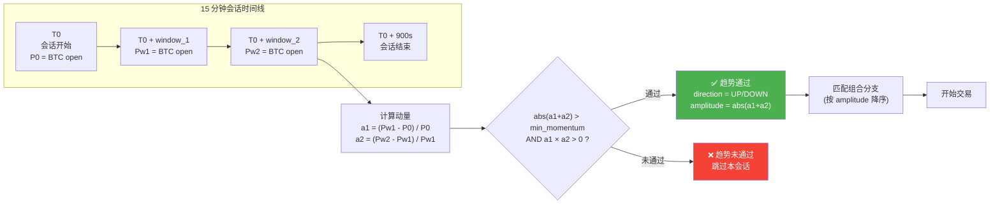

---

## 6. 组合策略分支选择 (Composite Config)

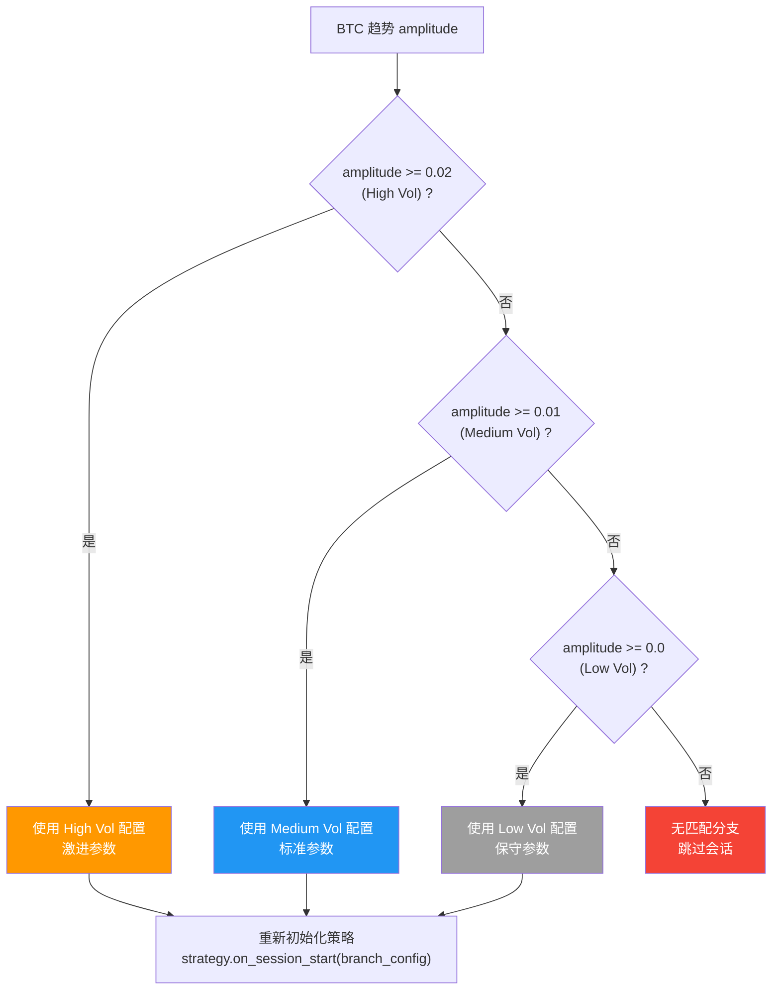

---

## 7. 策略入场/出场逻辑 (Btc15mLiveStrategy)

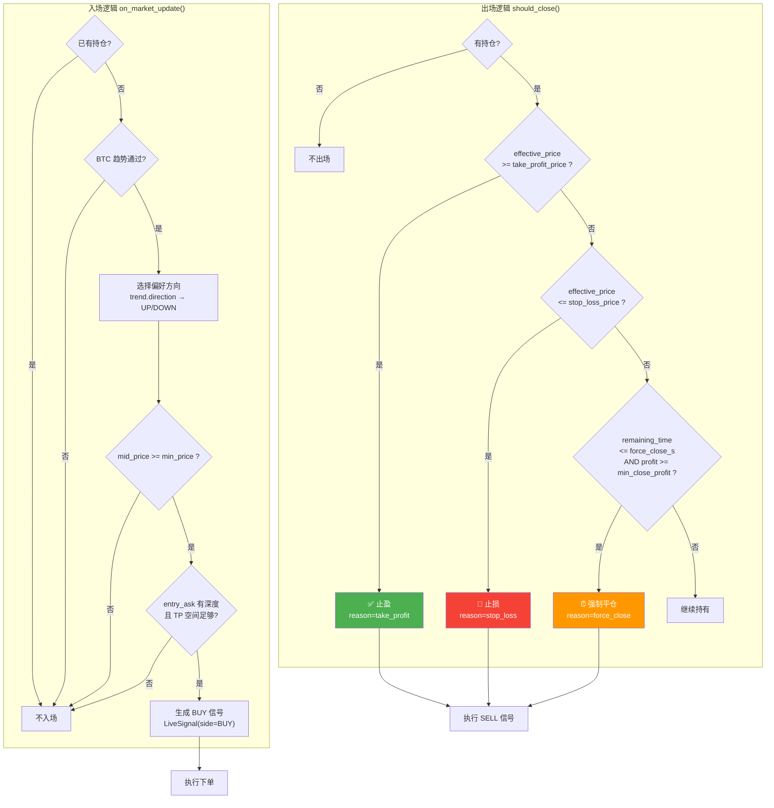

---

## 8. 订单执行流程

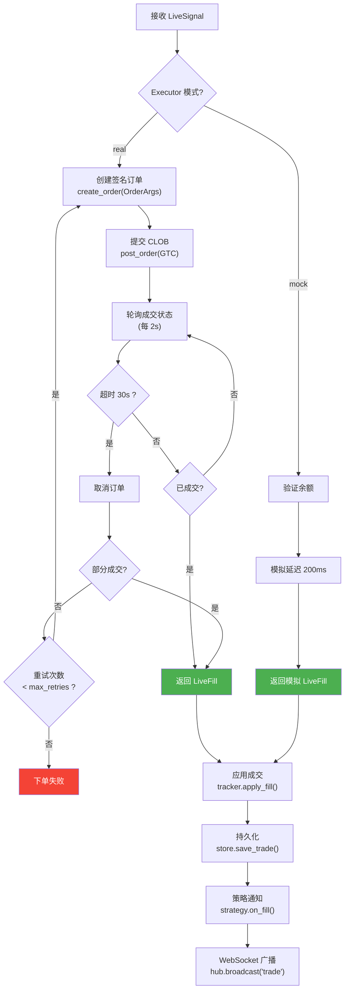

---

## 9. 结算流程

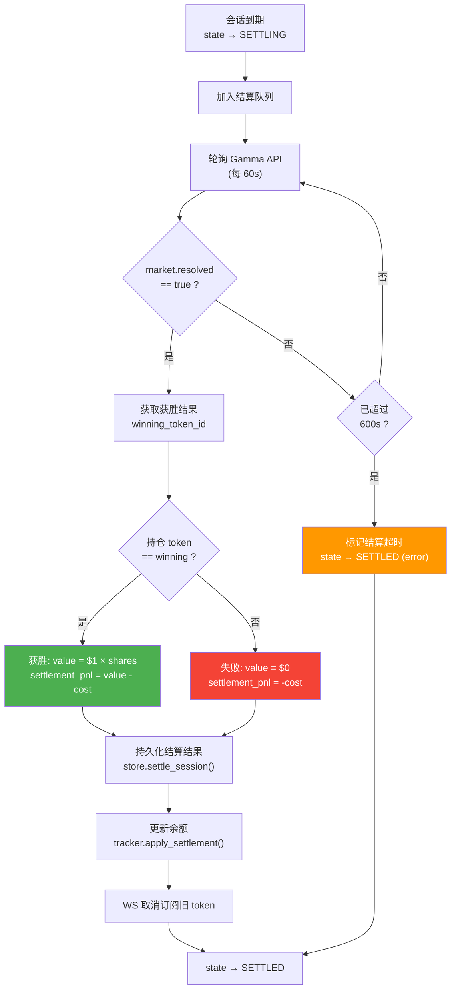

---

## 10. 实时数据流 (WebSocket)

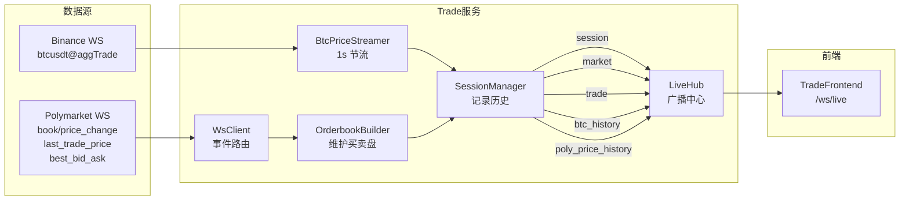

---

## 11. API 路由总览

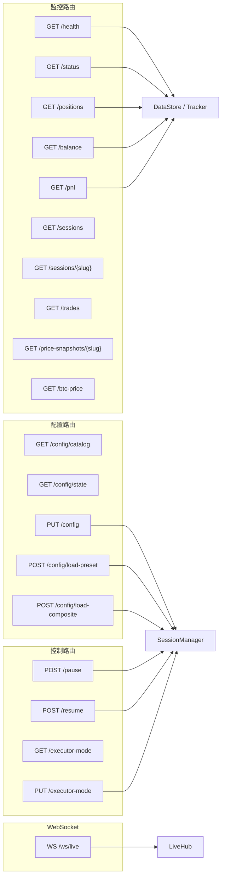

---

## 12. 锚定价格计算 (Tiered Anchor Price)

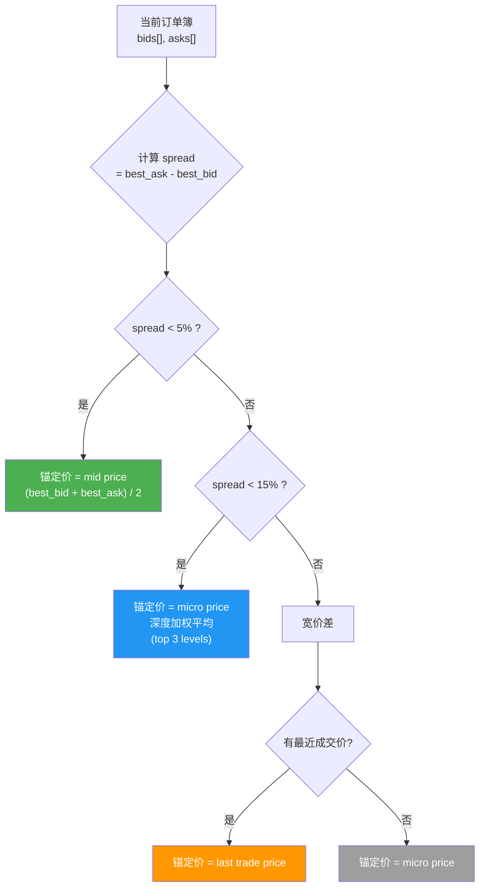

---

## 13. 文件模块依赖关系

```mermaid
graph TD
    main["main.py"] --> app["api/app.py"]

    app --> sm["engine/session_manager.py"]
    app --> scanner["market/market_scanner.py"]
    app --> btc_stream["market/btc_price.py"]
    app --> store["infra/data_store.py"]
    app --> hub["infra/live_hub.py"]
    app --> exec_factory["execution/executor_factory.py"]
    app --> pos_tracker["portfolio/position_tracker.py"]
    app --> settle_tracker["portfolio/settlement_tracker.py"]

    sm --> se["engine/strategy_engine.py"]
    sm --> btc_trend["engine/btc_trend.py"]
    sm --> ws_client["market/ws_client.py"]
    sm --> ob["market/orderbook_builder.py"]
    sm --> strat["strategies/btc_15m_live.py"]
    sm --> types["models/types.py"]

    exec_factory --> real_exec["execution/order_executor.py"]
    exec_factory --> mock_exec["execution/mock_executor.py"]
    real_exec --> base_exec["execution/base_executor.py"]
    mock_exec --> base_exec

    app --> monitor["api/monitor_routes.py"]
    app --> config_rt["api/config_routes.py"]
    app --> control["api/control_routes.py"]
    app --> ws_handler["api/ws_handler.py"]
    app --> auth["api/auth.py"]

    config_rt --> se
    ws_handler --> hub

    style main fill:#FF9800,color:#fff
    style sm fill:#2196F3,color:#fff
    style strat fill:#4CAF50,color:#fff
```

---

## 14. 关键配置参数

| 参数 | 默认值 | 说明 |
|------|--------|------|
| `TRADE_EXECUTOR_MODE` | `mock` | 执行模式: real / mock |
| `TRADE_SCAN_INTERVAL_S` | `120` | 市场扫描间隔 (秒) |
| `TRADE_SCAN_SLUG_PREFIX` | `btc-updown-15m` | 市场 slug 前缀 |
| `TRADE_SCAN_DURATION_S` | `900` | 会话时长 (15 分钟) |
| `TRADE_SESSION_PREPARE_AHEAD_S` | `60` | 提前预订阅 WS (秒) |
| `TRADE_MIN_TRADE_USDC` | `10.0` | 最小下单金额 (USDC) |
| `TRADE_ORDER_TIMEOUT_S` | `30` | 下单超时 (秒) |
| `TRADE_ORDER_MAX_RETRIES` | `3` | 下单最大重试次数 |
| `TRADE_SETTLEMENT_POLL_INTERVAL_S` | `60` | 结算轮询间隔 (秒) |
| `TRADE_SETTLEMENT_POLL_MAX_S` | `600` | 结算最长等待 (秒) |

---

## 15. 数据持久化 (DuckDB Schema)

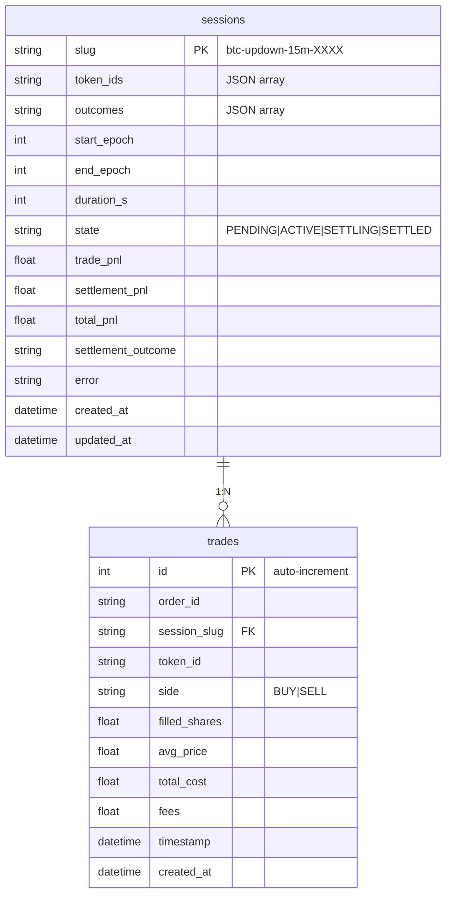
